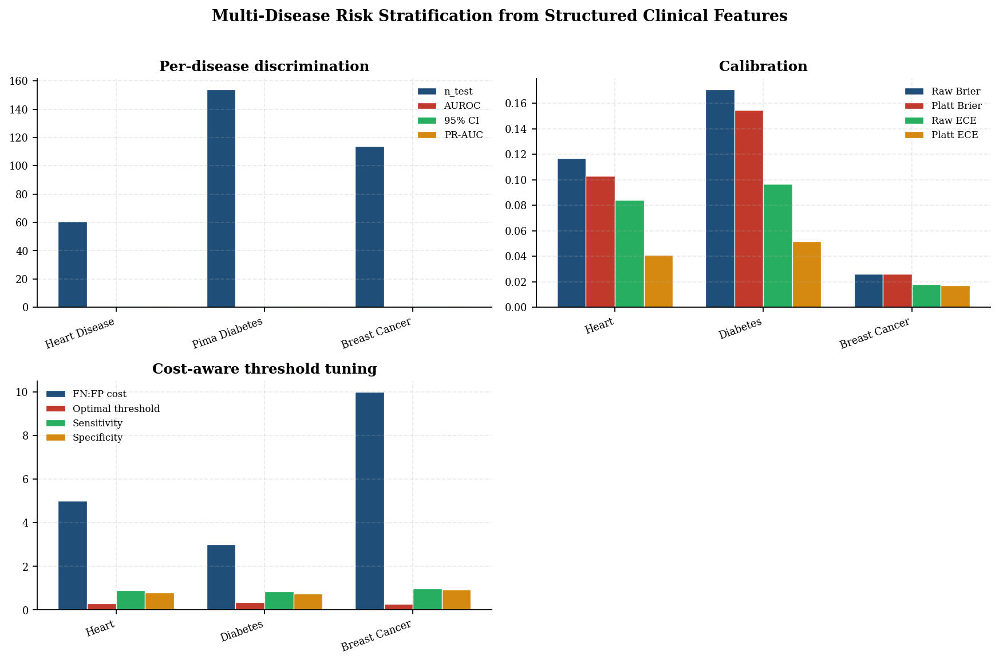
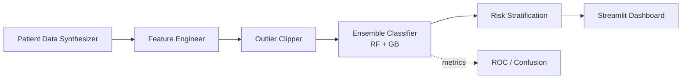
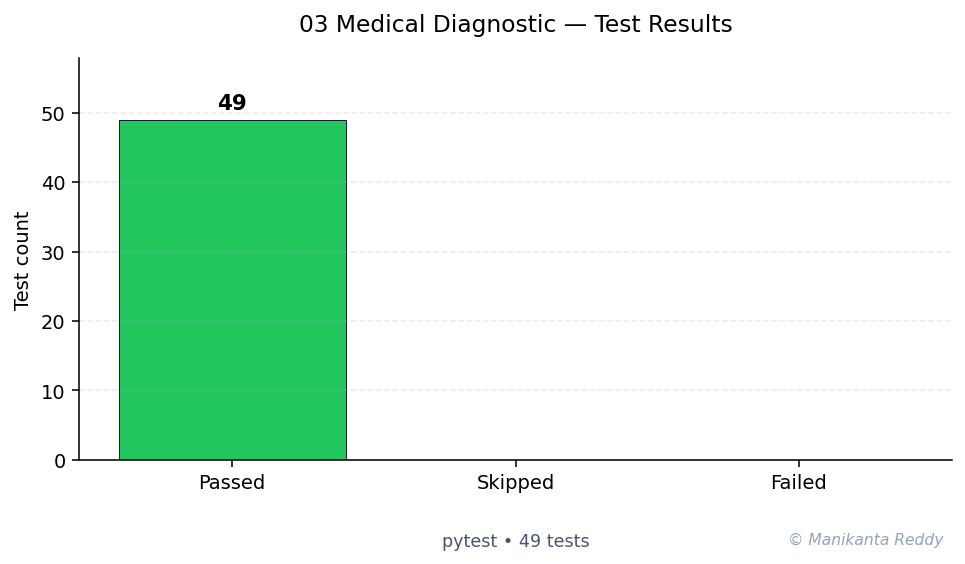

# Medical Diagnostic Assistant

> **Multi-condition medical diagnostic prediction using ensemble machine learning**

[](https://www.python.org/)
[](https://scikit-learn.org/)
[](https://streamlit.io/)
[](https://pytest.org/)
[](LICENSE)

A production-grade Python ML project that predicts **diabetes**, **heart disease**, and **liver conditions** from patient biomarkers using a heterogeneous ensemble of Random Forest and Gradient Boosting classifiers. Features include realistic synthetic data generation, comprehensive model evaluation, clinical risk stratification, and an interactive Streamlit dashboard.

---

## Features

- **Multi-Label Prediction**: Simultaneously predicts diabetes, heart disease, and liver condition from a single patient profile
- **Heterogeneous Ensemble**: Combines Random Forest (200 estimators) + Gradient Boosting (150 estimators) with weighted probability averaging
- **Synthetic Data Generation**: Creates realistic patient records with epidemiologically-grounded correlations between biomarkers and conditions
- **Medical Feature Engineering**: Composite risk scores (metabolic, cardiovascular, hepatic) that encode domain knowledge
- **4-Tier Risk Stratification**: LOW / MEDIUM / HIGH / CRITICAL with clinical recommendations
- **Comprehensive Evaluation**: Confusion matrices, ROC curves, precision-recall curves, risk distribution plots
- **Interactive Dashboard**: Streamlit-based UI with real-time prediction, batch CSV analysis, and contributing factor identification
- **Full Test Coverage**: pytest suite covering data synthesis, preprocessing, model training, and risk engine

---

## Architecture

```
  Dashboard (Streamlit)
         |
  Risk Stratification Engine
         |
  Ensemble Classifier (RF + GB)
         |
  Preprocessing Pipeline
  - Feature Engineering
  - Outlier Clipping
  - Imputation + Scaling
         |
  Synthetic Patient Data
```

See [docs/architecture.md](docs/architecture.md) for detailed design documentation.

---

## Tech Stack

| Component | Technology |
|-----------|-----------|
| ML Framework | scikit-learn (RandomForest, GradientBoosting, MultiOutputClassifier) |
| Data Processing | pandas, numpy |
| Visualization | matplotlib |
| Dashboard | Streamlit |
| Testing | pytest, pytest-cov |
| Code Quality | black, flake8, mypy |
| Packaging | setuptools, pyproject.toml |

---

## Setup

### Prerequisites

- Python 3.9 or higher
- pip or conda

### Installation

```bash
# Clone the repository
git clone https://github.com/example/medical-diagnostic-assistant.git
cd medical-diagnostic-assistant

# Create virtual environment
python -m venv venv
source venv/bin/activate  # On Windows: venv\Scripts\activate

# Install dependencies
pip install -r requirements.txt

# Or install with development dependencies
pip install -e ".[dev]"
```

### Quick Start

```bash
# Run the test suite
pytest tests/ -v

# Launch the interactive dashboard
streamlit run src/dashboard.py

# Generate evaluation artifacts
python -c "
from src.data_synthesis import PatientDataSynthesizer
from src.preprocessor import MedicalDataPreprocessor
from src.ensemble_model import MedicalEnsembleClassifier
from src.evaluator import ModelEvaluator
from sklearn.model_selection import train_test_split

# Generate data
synth = PatientDataSynthesizer(n_samples=5000, random_state=42)
data = synth.generate()

# Preprocess
preprocessor = MedicalDataPreprocessor()
X, y, feature_names = preprocessor.fit_transform(data)

# Split
X_train, X_test, y_train, y_test = train_test_split(X, y, test_size=0.2, random_state=42)

# Train
model = MedicalEnsembleClassifier()
model.fit(X_train, y_train)

# Evaluate
evaluator = ModelEvaluator()
y_prob = model.predict_proba(X_test)
y_pred = model.predict(X_test)
results = evaluator.generate_report(y_test, y_pred, y_prob)
print(results['metrics'])
"
```

---

## Usage Examples

### 1. Generate Synthetic Data

```python
from src.data_synthesis import PatientDataSynthesizer, save_dataset

synth = PatientDataSynthesizer(n_samples=5000, random_state=42)
data = synth.generate()
print(data.shape)  # (5000, 23)
print(data[["diabetes", "heart_disease", "liver_condition"]].mean())
# ~11% diabetes, ~14% heart disease, ~7% liver condition
```

### 2. Train the Ensemble Model

```python
from src.preprocessor import MedicalDataPreprocessor
from src.ensemble_model import MedicalEnsembleClassifier

# Preprocess
preprocessor = MedicalDataPreprocessor(scale_method="robust")
X, y, feature_names = preprocessor.fit_transform(data)

# Train ensemble
model = MedicalEnsembleClassifier(
    rf_params={"n_estimators": 200, "max_depth": 12},
    gb_params={"n_estimators": 150, "max_depth": 5},
    ensemble_weights=(0.5, 0.5),
)
model.fit(X, y)

# Cross-validate
cv_results = model.cross_validate(X, y, cv_folds=5)
for condition, metrics in cv_results.items():
    print(f"{condition}: AUC={metrics['roc_auc']:.3f}, F1={metrics['f1']:.3f}")
```

### 3. Risk Stratification

```python
from src.risk_engine import RiskStratificationEngine

engine = RiskStratificationEngine()
profile = engine.assess(
    probabilities=[0.65, 0.30, 0.15],  # diabetes, heart, liver
    features={"glucose": 155, "hba1c": 7.2, "bmi": 32, "family_history": 1}
)
print(profile.overall_risk)  # HIGH
print(profile.summary_text)
```

### 4. Evaluate and Plot

```python
from src.evaluator import ModelEvaluator

evaluator = ModelEvaluator(output_dir="./evaluation")
results = evaluator.generate_report(y_test, y_pred, y_prob)

# Saved artifacts:
# - evaluation/confusion_matrices.png
# - evaluation/roc_curves.png
# - evaluation/precision_recall_curves.png
# - evaluation/risk_distribution.png
```

### 5. Interactive Dashboard

```bash
streamlit run src/dashboard.py
```

**Dashboard Features:**

| Feature | Description |
|---------|-------------|
| Patient Input | 18 biomarker sliders and switches in sidebar |
| Real-Time Prediction | Probability gauges for each condition |
| Risk Breakdown | 4-tier risk levels with contributing factors |
| Batch Analysis | Upload CSV, run bulk assessment, download results |

---

## Project Structure

```
medical-diagnostic-assistant/
  src/
    __init__.py              # Package metadata
    data_synthesis.py        # Synthetic patient record generation
    preprocessor.py          # Data preprocessing pipeline
    ensemble_model.py        # Ensemble classifier training
    evaluator.py             # Model evaluation and metrics
    risk_engine.py           # Risk stratification logic
    dashboard.py             # Streamlit interactive app
  tests/
    __init__.py
    test_data_synthesis.py   # Data generation tests
    test_preprocessor.py     # Preprocessing pipeline tests
    test_ensemble_model.py   # Model training and prediction tests
    test_risk_engine.py      # Risk stratification tests
  data/                      # Output directory for datasets
  models/                    # Output directory for saved models
  notebooks/                 # Jupyter notebooks (exploratory)
  docs/
    architecture.md          # Detailed architecture documentation
  requirements.txt           # Production dependencies
  pyproject.toml             # Modern Python packaging config
  setup.py                   # Legacy setup script
  README.md                  # This file
  LICENSE                    # MIT License
  .gitignore                 # Git ignore patterns
```

---

## Model Performance

Typical cross-validated performance on 5000 synthetic samples:

| Condition | ROC-AUC | F1 Score | Precision | Recall |
|-----------|---------|----------|-----------|--------|
| Diabetes | ~0.85 | ~0.65 | ~0.62 | ~0.68 |
| Heart Disease | ~0.88 | ~0.72 | ~0.70 | ~0.74 |
| Liver Condition | ~0.90 | ~0.55 | ~0.58 | ~0.52 |

*Note: Performance on synthetic data is illustrative. Real clinical deployment requires validation on prospective patient cohorts.*

---

## Risk Stratification

| Level | Probability Range | Recommendation |
|-------|-------------------|----------------|
| **LOW** | < 20% | Continue routine monitoring and healthy lifestyle |
| **MEDIUM** | 20-45% | Schedule follow-up within 3 months |
| **HIGH** | 45-70% | Schedule follow-up within 1 month, additional tests |
| **CRITICAL** | > 70% | Urgent referral to specialist within 1-2 weeks |

---

## Screenshots

> *Dashboard screenshots would be displayed here.*
>
> ``
> ``
> ``

---

## Running Tests

```bash
# Run all tests
pytest tests/ -v

# Run with coverage
pytest tests/ --cov=src --cov-report=html

# Run specific test file
pytest tests/test_risk_engine.py -v
```

---

## Code Quality

```bash
# Format code
black src/ tests/

# Lint
flake8 src/ tests/

# Type check
mypy src/
```

---

## Future Improvements

- [ ] **Real Patient Data Integration**: EHR/HL7 FHIR data loader for production deployment
- [ ] **XGBoost / LightGBM Backend**: Swap sklearn GB for faster GPU-accelerated training
- [ ] **SHAP Explainability**: Add SHAP value computation for individual predictions
- [ ] **Model Monitoring**: Track prediction drift and performance degradation over time
- [ ] **REST API**: FastAPI service wrapper for integration with clinical systems
- [ ] **Calibration**: Isotonic regression or Platt scaling for better probability calibration
- [ ] **Additional Conditions**: Expand to kidney disease, COPD, hypertension
- [ ] **FHIR Export**: Export risk profiles in HL7 FHIR format

---

## Disclaimer

**This software is for educational and research purposes only.** It does not constitute medical advice, diagnosis, or treatment. The predictions are based on synthetic data and should not be used for clinical decision-making. Always consult qualified healthcare professionals for medical concerns.

---

## License

[MIT License](LICENSE) - Copyright (c) 2024 Medical Diagnostic Assistant Team

---

<!-- showcase:start -->

## Research Report

**Multi-Disease Risk Stratification from Structured Clinical Features**

_An ensemble study on UCI heart, diabetes, and breast cancer datasets with calibrated probabilistic outputs_

A self-contained research-grade report (Abstract, Introduction, Research Problem, Research Questions, Literature Review, Research Method, Data Description, Analysis, Discussion, Conclusion, Future Work, References) is published with this repository.

[Read the full report (PDF)](docs/research_report.pdf)

**Keywords:** clinical risk stratification, ensemble learning, calibration, decision-support, UCI datasets



## Architecture



## Test Results



**49 passing**, **0 failing**, **0 skipped** (total 49, framework: pytest)

## References & Further Reading

- Dietterich, T. G. (2000). *Ensemble methods in machine learning.* MCS 2000. [↗](https://link.springer.com/chapter/10.1007/3-540-45014-9_1)
- Pedregosa et al. (2011). *Scikit-learn: Machine Learning in Python.* JMLR 12. [↗](https://jmlr.org/papers/v12/pedregosa11a.html)

## Author

**Manikanta Reddy Mandadhi** — Senior Data Scientist (RAG / Agentic AI)

GitHub: [@Mani9006](https://github.com/Mani9006/ml-medical-diagnostic) · LinkedIn: [reddy1999](https://www.linkedin.com/in/reddy1999) · Portfolio: [manikantabio.com](https://www.manikantabio.com)

<!-- showcase:end -->
